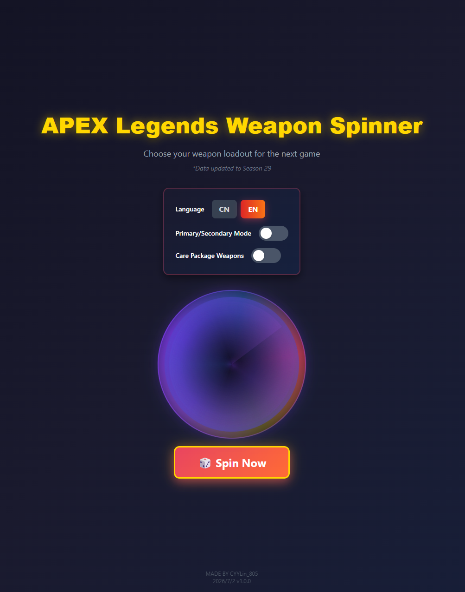
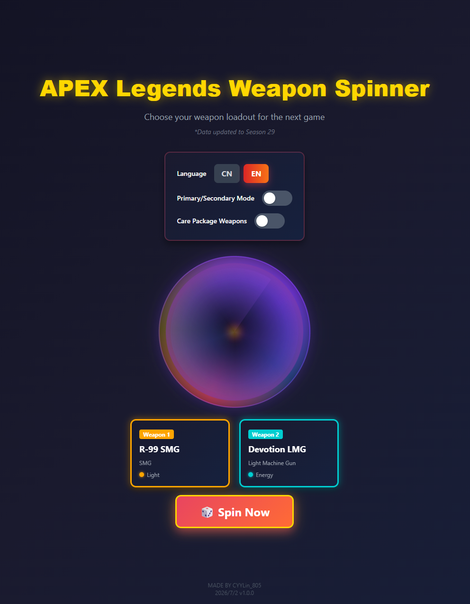

# APEX Legends Weapon Spinner

> A random weapon picker tool based on APEX Legends Season 29 weapon data, featuring a void portal-style dynamic draw animation.

English | [简体中文](./README.md)

---

## Live Demo

👉 **Try it now**: https://tapkeen.github.io/APEX-Legends-WeaponSpinner/

---

## Screenshots

### Home Page



### Draw Result



---

## Features

### 🎮 Weapon Draw
- **Random Draw**: Draw two random weapons from the full pool
- **Primary/Secondary Mode**: When enabled, draws one primary weapon and one secondary weapon
- **Care Package Toggle**: Choose whether to include care package weapons

### 🔫 Weapon Categories (Season 29)
- **Primary Weapons**: Assault Rifles, Sniper Rifles, Marksman Weapons, Light Machine Guns
- **Secondary Weapons**: Submachine Guns, Pistols, Shotguns
- **Care Package**: Kraber, G7 Scout, L-STAR

### 🌐 Bilingual Support
- One-click switch between Chinese and English
- Weapon names in both languages

### 🎨 APEX-Style Color Scheme
- Dark sci-fi background
- Weapon card background colors by ammo type
  - 🟡 Light Rounds - Yellow
  - 🟢 Heavy Rounds - Dark green
  - 💚 Energy Ammo - Light green
  - 🏹 Arrows - Lighter green (paler than energy)
  - 🔵 Sniper Ammo - Blue
  - 🔴 Shotgun Shells - Red
  - ⭐ Care Package - Red + gold border

---

## Weapon List

### Primary Weapons

#### Assault Rifles
| Weapon Name | Chinese Name | Ammo Type |
|------------|-------------|-----------|
| HAVOC Rifle | 哈沃克步枪 | Energy |
| VK-47 Flatline | 平行步枪 | Heavy |
| Hemlok Burst AR | 赫姆洛克突击步枪 | Heavy |
| R-301 Carbine | R-301 卡宾枪 | Light |
| Nemesis Burst AR | 复仇女神 | Energy |

#### Sniper Rifles
| Weapon Name | Chinese Name | Ammo Type |
|------------|-------------|-----------|
| Kraber .50-Cal Sniper | 克雷贝尔狙击枪 | Sniper ⭐ Care Package |
| Charge Rifle | 充能步枪 | Sniper |
| Longbow DMR | 长弓 | Sniper |
| Sentinel | 哨兵狙击步枪 | Sniper |

#### Marksman Weapons
| Weapon Name | Chinese Name | Ammo Type |
|------------|-------------|-----------|
| G7 Scout | G7 侦察枪 | Light ⭐ Care Package |
| Triple Take | 三重式狙击枪 | Energy |
| 30-30 Repeater | 30-30 | Heavy |
| Bocek Compound Bow | 波塞克 | Arrows |

#### Light Machine Guns
| Weapon Name | Chinese Name | Ammo Type |
|------------|-------------|-----------|
| Devotion LMG | 专注轻机枪 | Energy |
| L-STAR EMG | L-STAR | Energy ⭐ Care Package |
| M600 Spitfire | 喷火轻机枪 | Light |
| Rampage LMG | 暴走轻机枪 | Heavy |

### Secondary Weapons

#### Submachine Guns
| Weapon Name | Chinese Name | Ammo Type |
|------------|-------------|-----------|
| Alternator SMG | 转换者冲锋枪 | Light |
| Prowler Burst PDW | 猎兽冲锋枪 | Heavy |
| R-99 SMG | R-99 冲锋枪 | Light |
| Volt SMG | 电能冲锋枪 | Energy |
| C.A.R. SMG | C.A.R. | Heavy/Light |

#### Pistols
| Weapon Name | Chinese Name | Ammo Type |
|------------|-------------|-----------|
| RE-45 Auto | RE-45 | Energy |
| P2020 | P2020 手枪 | Light |
| Wingman | 辅助手枪 | Sniper |

#### Shotguns
| Weapon Name | Chinese Name | Ammo Type |
|------------|-------------|-----------|
| EVA-8 Auto | EVA-8 | Shotgun |
| Mastiff | 獒犬霰弹枪 | Shotgun |
| Mozambique Shotgun | 莫桑比克 | Shotgun |
| Peacekeeper | 和平捍卫者霰弹枪 | Shotgun |

---

## Tech Stack

- **Framework**: React 18 + TypeScript
- **Build Tool**: Vite
- **Styling**: Tailwind CSS
- **Routing**: React Router (HashRouter for GitHub Pages compatibility)
- **Deployment**: GitHub Pages + GitHub Actions

---

## Local Development

```bash
# Install dependencies
npm install

# Start dev server
npm run dev

# Build for production
npm run build

# Preview production build
npm run preview
```

---

## Deployment

This project is automatically deployed to GitHub Pages via GitHub Actions. Every push to the `main` branch triggers a build and deploy.

Deployment config: [`.github/workflows/deploy.yml`](./.github/workflows/deploy.yml)

---

## Author

**MADE BY CYYLin_805**

**2026/7/2  v1.0.0**

---

## Appendix: Original Template README

The following content is from the original Vite + React + TypeScript template README.

---

# React + TypeScript + Vite

This template provides a minimal setup to get React working in Vite with HMR and some ESLint rules.

Currently, two official plugins are available:

- [@vitejs/plugin-react](https://github.com/vitejs/vite-plugin-react/blob/main/packages/plugin-react) uses [Babel](https://babeljs.io/) for Fast Refresh
- [@vitejs/plugin-react-swc](https://github.com/vitejs/vite-plugin-react/blob/main/packages/plugin-react-swc) uses [SWC](https://swc.rs/) for Fast Refresh

## Expanding the ESLint configuration

If you are developing a production application, we recommend updating the configuration to enable type-aware lint rules:

```js
export default tseslint.config({
  extends: [
    // Remove ...tseslint.configs.recommended and replace with this
    ...tseslint.configs.recommendedTypeChecked,
    // Alternatively, use this for stricter rules
    ...tseslint.configs.strictTypeChecked,
    // Optionally, add this for stylistic rules
    ...tseslint.configs.stylisticTypeChecked,
  ],
  languageOptions: {
    // other options...
    parserOptions: {
      project: ['./tsconfig.node.json', './tsconfig.app.json'],
      tsconfigRootDir: import.meta.dirname,
    },
  },
})
```

You can also install [eslint-plugin-react-x](https://github.com/Rel1cx/eslint-react/tree/main/packages/plugins/eslint-plugin-react-x) and [eslint-plugin-react-dom](https://github.com/Rel1cx/eslint-react/tree/main/packages/plugins/eslint-plugin-react-dom) for React-specific lint rules:

```js
// eslint.config.js
import reactX from 'eslint-plugin-react-x'
import reactDom from 'eslint-plugin-react-dom'

export default tseslint.config({
  extends: [
    // other configs...
    // Enable lint rules for React
    reactX.configs['recommended-typescript'],
    // Enable lint rules for React DOM
    reactDom.configs.recommended,
  ],
  languageOptions: {
    // other options...
    parserOptions: {
      project: ['./tsconfig.node.json', './tsconfig.app.json'],
      tsconfigRootDir: import.meta.dirname,
    },
  },
})
```
