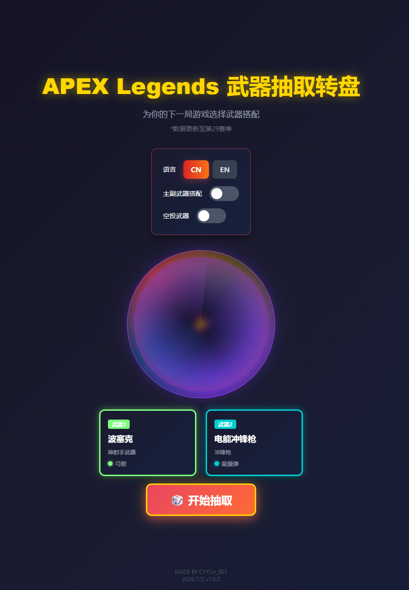

# APEX Legends Weapon Spinner

> 一款基于 APEX Legends 第 29 赛季武器数据的随机武器抽取工具，采用虚空传送门风格的动态抽选动画。

🇨🇳 简体中文 | [🇬🇧 English](./README.en.md)

---

## 在线体验

👉 **立即使用**：https://tapkeen.github.io/APEX-Legends-WeaponSpinner/

> 📌 后续根据赛季更新的武器变动，抽取工具的武器库也会同步更新。

---

## 效果截图

### 初始页面


### 抽取结果



---

## 功能特性

### 🎮 武器抽取
- **随机抽取**：从所有武器中随机抽取两把
- **主副搭配模式**：开启后从主武器池和副武器池各抽取一把
- **空投武器开关**：可选择是否包含空投武器

### 🔫 武器分类（第 29 赛季）
- **主武器**：突击步枪、狙击步枪、神射手武器、轻型机关枪
- **副武器**：冲锋枪、手枪、霰弹枪
- **空投武器**：克雷贝尔狙击枪、G7 侦察枪、L-STAR

### 🌐 中英文切换
- 一键切换中英文界面
- 武器名称中英对照

### 🎨 APEX 风格配色
- 深色科技感背景
- 按弹药类型区分武器卡片背景色
  - 🟡 轻型弹 - 黄色
  - 🟢 重型弹 - 墨绿色
  - 💚 能量弹 - 浅绿色
  - 🏹 弓箭 - 浅绿（比能量弹更浅）
  - 🔵 狙击弹 - 蓝色
  - 🔴 霰弹 - 红色
  - ⭐ 空投武器 - 红色 + 金边

---

## 武器列表

### 主武器

#### 突击步枪
| 武器名称 | 名称 | 弹药类型 |
|---------|------|---------|
| HAVOC Rifle | 哈沃克步枪 | 能量弹 |
| VK-47 Flatline | 平行步枪 | 重型弹 |
| Hemlok Burst AR | 赫姆洛克突击步枪 | 重型弹 |
| R-301 Carbine | R-301 卡宾枪 | 轻型弹 |
| Nemesis Burst AR | 复仇女神 | 能量弹 |

#### 狙击步枪
| 武器名称 | 名称 | 弹药类型 |
|---------|------|---------|
| Kraber .50-Cal Sniper | 克雷贝尔狙击枪 | 狙击弹 ⭐ 空投 |
| Charge Rifle | 充能步枪 | 狙击弹 |
| Longbow DMR | 长弓 | 狙击弹 |
| Sentinel | 哨兵狙击步枪 | 狙击弹 |

#### 神射手武器
| 武器名称 | 名称 | 弹药类型 |
|---------|------|---------|
| G7 Scout | G7 侦察枪 | 轻型弹 ⭐ 空投 |
| Triple Take | 三重式狙击枪 | 能量弹 |
| 30-30 Repeater | 30-30 | 重型弹 |
| Bocek Compound Bow | 波塞克 | 弓箭 |

#### 轻型机关枪
| 武器名称 | 名称 | 弹药类型 |
|---------|------|---------|
| Devotion LMG | 专注轻机枪 | 能量弹 |
| L-STAR EMG | L-STAR | 能量弹 ⭐ 空投 |
| M600 Spitfire | 喷火轻机枪 | 轻型弹 |
| Rampage LMG | 暴走轻机枪 | 重型弹 |

### 副武器

#### 冲锋枪
| 武器名称 | 名称 | 弹药类型 |
|---------|------|---------|
| Alternator SMG | 转换者冲锋枪 | 轻型弹 |
| Prowler Burst PDW | 猎兽冲锋枪 | 重型弹 |
| R-99 SMG | R-99 冲锋枪 | 轻型弹 |
| Volt SMG | 电能冲锋枪 | 能量弹 |
| C.A.R. SMG | C.A.R. | 重型弹/轻型弹 |

#### 手枪
| 武器名称 | 名称 | 弹药类型 |
|---------|------|---------|
| RE-45 Auto | RE-45 | 能量弹 |
| P2020 | P2020 手枪 | 轻型弹 |
| Wingman | 辅助手枪 | 狙击弹 |

#### 霰弹枪
| 武器名称 | 名称 | 弹药类型 |
|---------|------|---------|
| EVA-8 Auto | EVA-8 | 霰弹 |
| Mastiff | 獒犬霰弹枪 | 霰弹 |
| Mozambique Shotgun | 莫桑比克 | 霰弹 |
| Peacekeeper | 和平捍卫者霰弹枪 | 霰弹 |

---

## 技术栈

- **框架**：React 18 + TypeScript
- **构建工具**：Vite
- **样式**：Tailwind CSS
- **路由**：React Router（HashRouter，适配 GitHub Pages）
- **部署**：GitHub Pages + GitHub Actions

---

## 本地开发

```bash
# 安装依赖
npm install

# 启动开发服务器
npm run dev

# 构建生产版本
npm run build

# 预览构建产物
npm run preview
```

---

## 部署

本项目通过 GitHub Actions 自动部署到 GitHub Pages。每次向 `main` 分支推送代码后，会自动触发构建并部署。

部署配置文件：[`.github/workflows/deploy.yml`](./.github/workflows/deploy.yml)

---

## 作者

**MADE BY CYYLin_805**

**2026/7/2  v1.0.0**

---

## 附录：原始模板说明

以下内容来自 Vite + React + TypeScript 项目模板的原始 README。

---

# React + TypeScript + Vite

This template provides a minimal setup to get React working in Vite with HMR and some ESLint rules.

Currently, two official plugins are available:

- [@vitejs/plugin-react](https://github.com/vitejs/vite-plugin-react/blob/main/packages/plugin-react) uses [Babel](https://babeljs.io/) for Fast Refresh
- [@vitejs/plugin-react-swc](https://github.com/vitejs/vite-plugin-react/blob/main/packages/plugin-react-swc) uses [SWC](https://swc.rs/) for Fast Refresh

## Expanding the ESLint configuration

If you are developing a production application, we recommend updating the configuration to enable type-aware lint rules:

```js
export default tseslint.config({
  extends: [
    // Remove ...tseslint.configs.recommended and replace with this
    ...tseslint.configs.recommendedTypeChecked,
    // Alternatively, use this for stricter rules
    ...tseslint.configs.strictTypeChecked,
    // Optionally, add this for stylistic rules
    ...tseslint.configs.stylisticTypeChecked,
  ],
  languageOptions: {
    // other options...
    parserOptions: {
      project: ['./tsconfig.node.json', './tsconfig.app.json'],
      tsconfigRootDir: import.meta.dirname,
    },
  },
})
```

You can also install [eslint-plugin-react-x](https://github.com/Rel1cx/eslint-react/tree/main/packages/plugins/eslint-plugin-react-x) and [eslint-plugin-react-dom](https://github.com/Rel1cx/eslint-react/tree/main/packages/plugins/eslint-plugin-react-dom) for React-specific lint rules:

```js
// eslint.config.js
import reactX from 'eslint-plugin-react-x'
import reactDom from 'eslint-plugin-react-dom'

export default tseslint.config({
  extends: [
    // other configs...
    // Enable lint rules for React
    reactX.configs['recommended-typescript'],
    // Enable lint rules for React DOM
    reactDom.configs.recommended,
  ],
  languageOptions: {
    // other options...
    parserOptions: {
      project: ['./tsconfig.node.json', './tsconfig.app.json'],
      tsconfigRootDir: import.meta.dirname,
    },
  },
})
```
